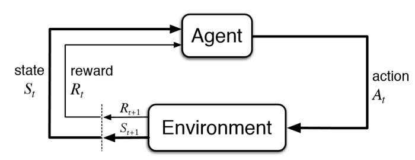

# holbertonschool-machine_learning

During my second year of Holberton School, I dived into Machine Learning, a part of computer programming concerning algorithms that can improve themselves by means of experience and data. We covered the three major parts of Machine Learning, as well as doing a bit of math.

Below are the key folders of this repository:

## [Supervised_Learning](https://github.com/faspen/holbertonschool-machine_learning/tree/main/supervised_learning)

## [Unsupervised_Learing](https://github.com/faspen/holbertonschool-machine_learning/tree/main/unsupervised_learning)

## [Reinforcement_Learning](https://github.com/faspen/holbertonschool-machine_learning/tree/main/reinforcement_learning)

## Creator

Finn Aspenson

* [Twitter](https://twitter.com/FAspenson)
* [LinkedIn](https://www.linkedin.com/in/finn-aspenson-0a23841b6/)
* Here's a notable [project](https://github.com/mlaizure/dragonfly)